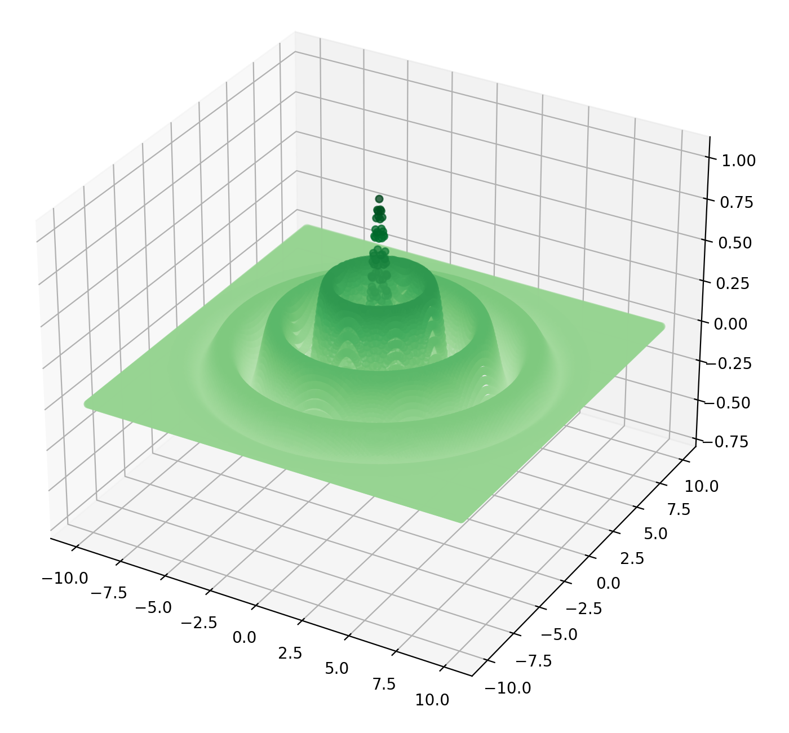
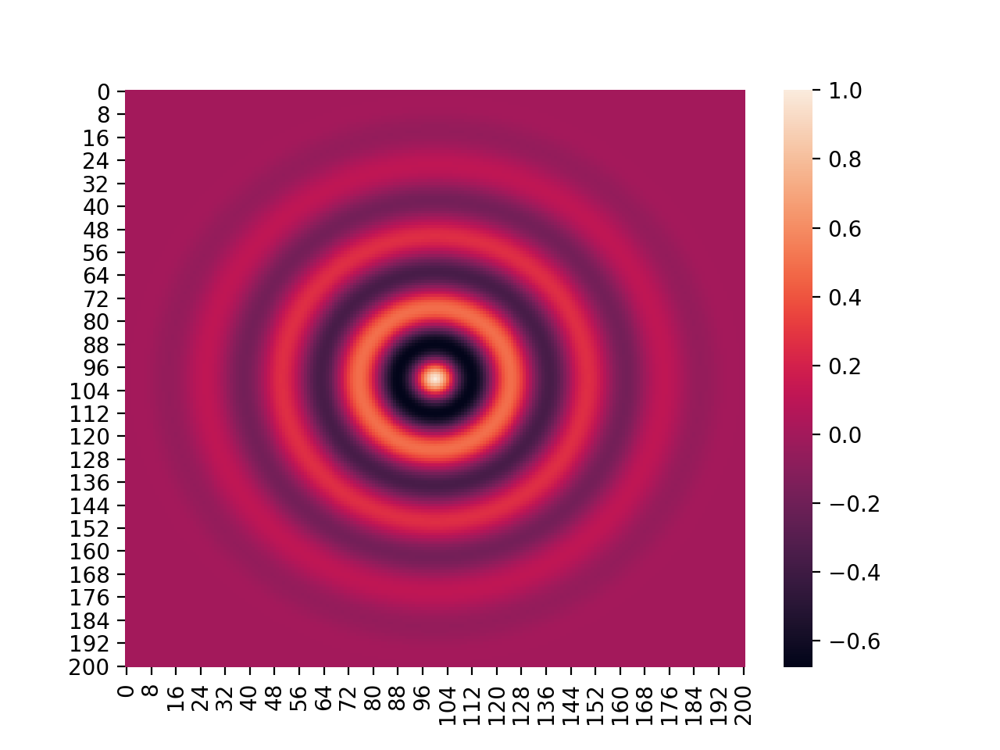

# Numpy Heatmap Tutorial

This tutorial is currently in progress.
Check back later.

### Data File

**Z Data for 80 X 80 graph:**  

[data/data_1_drop.csv](data/data_1_drop.csv)

### Images

**3D:**  

<cb><>

**Heat Map:**  

<cb><>

